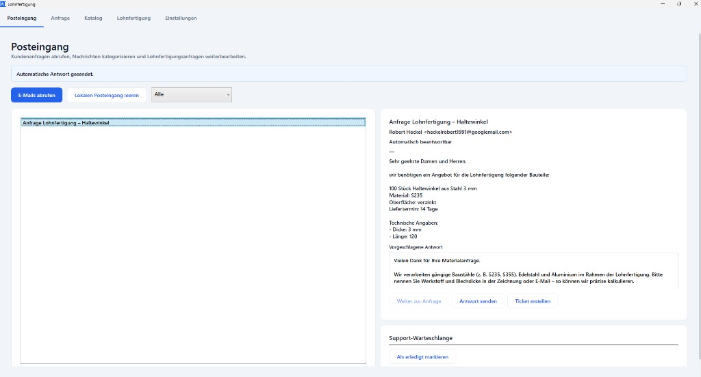
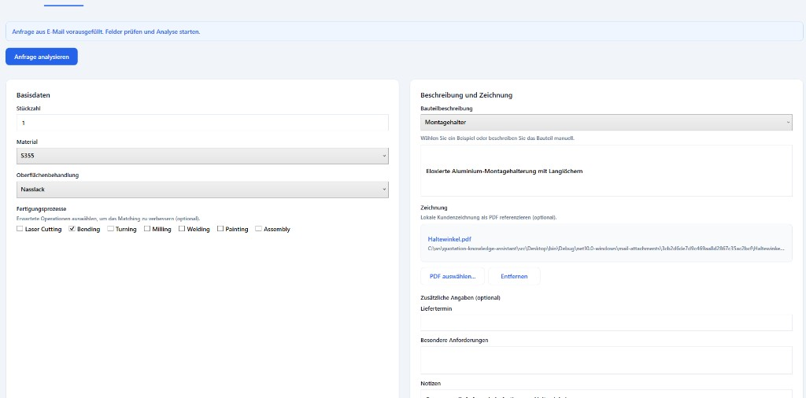
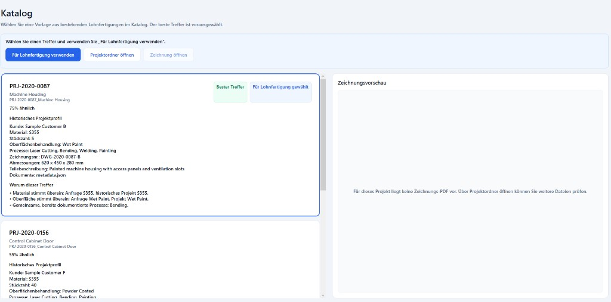
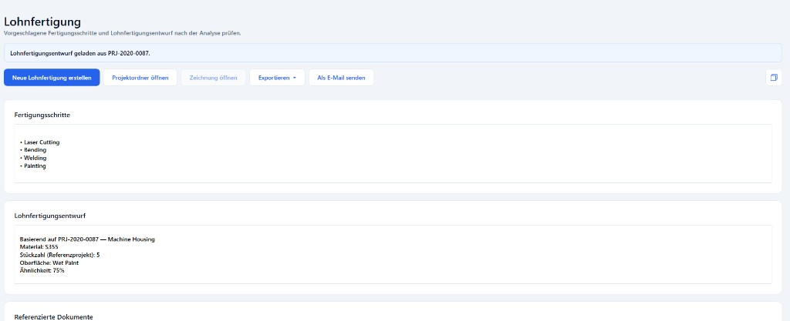

# Contract manufacturing

> **Beta demo — not for production use.** This is a prototype for evaluation and workshops only. It uses sample data, may change without notice, and is not a supported product.

**Built for engineers** who prepare *Lohnfertigung* (contract manufacturing) from customer drawings — find similar past projects in seconds and reuse drawings, manufacturing steps, and historical job knowledge instead of starting from zero.

**The question it answers:** *Have we manufactured something like this before?*

---

## The problem

Preparing a *Lohnfertigung* is repetitive and time-consuming. For each new inquiry an engineer must locate comparable past jobs, read drawings, work out manufacturing steps, and draft the technical content — often by digging through project folders and relying on memory. That work adds up across many inquiries and slows down quotation and technical review.

Much of this can be automated: the app matches new inquiries to your catalog and drafts manufacturing steps and *Lohnfertigung* content from the best historical match. AI can run **locally on your PC**, so customer data, drawings, and inquiry details stay **on your machine** — no cloud upload required. Cloud-based AI remains optional if you prefer it.

## What is it?

This repository ships a **Windows desktop prototype** for engineers — the fastest way to try the workflow on a pilot PC. The same capability can be delivered as a **web app or mobile app** when that fits your environment better. The software is structured so business logic stays separate from the user interface, which keeps it **easy to maintain, adapt, and extend** as your needs grow.

It connects a new customer inquiry to your historical project catalog: you enter material, quantity, surface treatment, and a short description (or pull details from an email inbox), and the app searches past jobs for the best matches.

For each match you get a similarity score, plain-language reasons, and direct access to project folders and drawing PDFs. The contract manufacturing workspace then suggests manufacturing steps and a *Lohnfertigung* draft you can review, edit, and copy into your existing process — cutting the manual rework that usually takes the most time.

Bundled sample data is included so you can explore the full workflow **without configuring anything** on first launch.

## Why use it?

| Challenge | How the app helps |
|-----------|-------------------|
| *Lohnfertigung* prep takes too long | Reuses manufacturing steps and drafts from comparable past jobs |
| Every new inquiry starts from scratch | Surfaces the three most similar projects immediately |
| Knowledge lives in folders and people's heads | Makes historical jobs searchable and explains *why* a match fits |
| Drawings are hard to find | Opens the right project folder and drawing PDF in one click |
| Sensitive data must stay in-house | Local AI runs on your PC; inquiry and document text never leave the machine unless you choose a cloud provider |

The goal is faster, more consistent technical review and shorter paths from inquiry to a usable *Lohnfertigung* draft.

## Who is it for?

**Primary audience: engineers** who perform technical reviews and prepare *Lohnfertigung* documentation from customer drawings.

Also relevant for:

- **Sales and contract manufacturing staff** who need quick orientation on whether you have done similar work before
- **Engineering management** evaluating whether structured knowledge reuse and local AI are worth investing in

If your team repeatedly asks *"have we done this before?"* and spends hours rebuilding manufacturing steps for each new job, this prototype shows what an engineer-focused workflow could look like.

---

## Interested? Request a demo

We are happy to walk you through the application and discuss how it could fit your process.

Email [info@heckel-informatik.de](mailto:info@heckel-informatik.de?subject=Demo%20-%20Contract%20manufacturing) to request a demo.

No commitment required — just tell us briefly what you manufacture and we will set up a short session.

---

## Or try it yourself

**New to the app?** Follow the [step-by-step user guide](docs/user-guide.md) (non-technical, install and demo walkthrough).

### Download

| | |
|---|---|
| **Installer (recommended)** | [Download latest MSI](https://github.com/HeckelRobert/contract-manufacturing-assistant/releases/latest/download/Contract-manufacturing-Setup.msi) |
| **All versions** | [GitHub Releases](https://github.com/HeckelRobert/contract-manufacturing-assistant/releases) |
| **Detailed instructions** | [User guide](docs/user-guide.md) |

### Requirements

- Windows 10 or 11 (64-bit)
- No .NET SDK required — the installer is self-contained

### Install and run

1. Download **Contract-manufacturing-Setup.msi** using the link above.
2. Double-click the installer and complete the wizard (see the [user guide](docs/user-guide.md) if Windows shows a security warning).
3. Start **Contract manufacturing** from the desktop shortcut or the Windows Start menu.

Uninstall later via **Windows Settings → Apps**. Full details: [user guide — Uninstall](docs/user-guide.md#uninstall).

> The technical repository and build identifiers may still use the name `QuotationAccelerator`.

### 5-minute walkthrough

1. Tab **Inquiry**: Material *Stainless Steel 1.4301*, surface *Powder Coated*, quantity *20*, description *Stainless enclosure*.
2. Click **Analyze Inquiry**.
3. Tab **Catalog**: best match **PRJ-2019-0142** — try another match, review the drawing preview, then **Open project folder** or **Open drawing**.
4. Tab **Contract manufacturing**: review the suggested *Lohnfertigung* draft → copy content to the clipboard.

Default UI language is German; switch to English under **Settings**.

### What you will see

| Step | What happens |
|------|----------------|
| Enter a customer inquiry | Material, quantity, surface treatment, short description |
| Analyze | The app searches your historical project catalog |
| Review top 3 matches | Similarity score and plain-language reasons |
| Open documents | Project folder and drawing PDF from a past job |
| Contract manufacturing workspace | Suggested manufacturing steps and *Lohnfertigung* draft — review, edit, copy into your process |

---

## Screenshots

### Inbox

Retrieve customer inquiries, categorize messages, and send automated replies for straightforward requests.



### Inquiry

Review inquiry details pre-filled from email, attach drawings, and start analysis.



### Catalog

Browse similar past projects with similarity scores, match reasoning, and drawing preview.



### Contract manufacturing workspace

Review suggested manufacturing steps and the contract manufacturing draft after analysis.



---

## For developers

Use this section if you maintain the prototype or **build the MSI** for distribution.

### Run from source

```powershell
dotnet restore QuotationAccelerator.sln
dotnet build QuotationAccelerator.sln
dotnet run --project src/Desktop/QuotationAccelerator.Desktop.csproj
```

Prerequisites: Windows 10/11, [.NET 10 SDK](https://dotnet.microsoft.com/download) (version pinned in `global.json`).

### Build the installer for distribution

```powershell
.\scripts\publish-installer.ps1
```

Output: `publish/installer/Contract-manufacturing-Setup.msi`

Demo PDFs for the flagship sample project are generated automatically during that script. To regenerate them only:

```powershell
.\scripts\generate-sample-pdfs.ps1
```

### Manual installer build

```powershell
dotnet build installer/QuotationAccelerator.Installer.wixproj -c Release
```

MSI path: `installer/bin/Release/Contract-manufacturing-Setup.msi`

### Publish a GitHub release

Tag a version to build the MSI and publish it to GitHub Releases automatically:

```powershell
git tag v0.1.2
git push origin v0.1.2
```

The release workflow uploads **Contract-manufacturing-Setup.msi** as a download asset. End users get it from [Releases](https://github.com/HeckelRobert/contract-manufacturing-assistant/releases/latest).

## Solution structure

```text
src/
  Desktop/           WPF shell (primary tabs)
  Catalog/           Project discovery and indexing
  Inquiry/           Customer inquiry domain
  Matching/          Rule-based and hybrid similarity search
  Infrastructure/    SQLite, file system, dispatcher, module registration
  SharedKernel/      Dispatcher abstractions and shared types
installer/           WiX MSI installer project
sample-data/         Bundled demonstration projects
scripts/             Installer and sample-data scripts
tests/               Unit and architecture tests
```

## Documentation

- [User guide](docs/user-guide.md) — install and demo walkthrough (non-technical)
- [Requirements](docs/requirements.md)
- [Architecture](docs/architecture.md)
- [Security](docs/security.md)
- [Operations](docs/operations.md)
